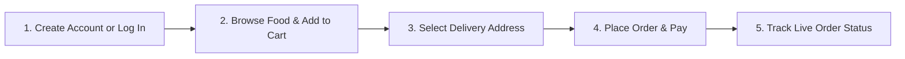

# Cafe 90 - Customer User Guide & Easy Step-by-Step Workflow

> **Welcome to Cafe 90!**  
> This friendly guide will walk you through everything you need to know about ordering your favorite food online from Cafe 90. It is written in simple, plain English with easy step-by-step instructions—no technical experience needed!

---

## 🌟 What is the Cafe 90 Customer App?

The Cafe 90 Customer App lets you browse delicious meals, drinks, and snacks, add items to your cart, place orders safely, and track your food delivery in real-time right from your phone or computer.

---

## 🛣️ Quick Overview: The 5-Step Customer Journey

Here is how simple ordering food is on Cafe 90:

---

## 📖 Step-by-Step Guide

### Step 1: Create an Account or Log In

To place an order, you need a free Cafe 90 account so we know where to send your food!

1. Open the Cafe 90 website.
2. Click the **"Log In"** or **"Register"** button at the top right corner of the screen.
3. If you are a **new customer**:
   - Fill in your **Full Name**, **Phone Number**, **Email Address**, and a **Password**.
   - Click **"Create Account"**.
4. If you already have an account:
   - Enter your registered email and password, then click **"Login"**.
5. Once logged in, your name will appear at the top bar, showing you are ready to order!

> 💡 **Tip:** Logging in saves your favorite delivery addresses so you don't have to type them every time you order!

---

### Step 2: Browse the Delicious Menu

Finding your favorite food is super easy!

1. Click on **"Menu"** in the top navigation bar.
2. You will see a list of delicious food items with photos, prices, descriptions, and star ratings.
3. **Filter your view**:
   - Click **"All"** to see everything.
   - Click **"Veg Only"** (🟢 Green icon) if you prefer vegetarian food.
   - Click **"Non-Veg"** (🔴 Red icon) for meat dishes.
   - Use category tabs like **Burgers**, **Pizzas**, **Beverages**, **Snacks**, or **Desserts** to find specific items fast.
4. **Search for food**:
   - Type dish names (like *"Paneer Tikka"* or *"Iced Coffee"*) into the search box at the top to instantly find what you crave.

---

### Step 3: Add Items to Your Cart

1. Next to any food item, click the green **"+ Add to Cart"** button.
2. If you want more than one quantity of an item:
   - Click the **"+"** button to add more.
   - Click the **"-"** button if you want fewer.
3. **The Floating Cart Bar (Bottom of Screen)**:
   - As soon as you add an item, a green bar pops up at the bottom of your screen (just like in Swiggy or Zomato!).
   - It shows how many items you picked and the total price.
   - Click **"View Cart & Checkout"** anytime to view your order summary.

---

### Step 4: Select Address & Checkout

When you are ready to order:

1. Click on your **Cart** or the bottom **Checkout Bar**.
2. **Review Your Cart**:
   - Check the items, quantities, subtotal price, and delivery fee.
3. **Choose Delivery Address**:
   - Select one of your saved delivery addresses (e.g., *Home*, *Work*), or click **"Add New Address"** to enter street name, building number, and landmark.
4. **Payment Option**:
   - Select your preferred payment method: **Cash on Delivery (COD)** or **UPI / Online Payment**.
5. **Special Instructions (Optional)**:
   - You can add notes like *"Please make it extra spicy"* or *"Leave at doorstep"*.
6. Click **"Place Order Now"**!

---

### Step 5: Track Your Order Live! 🚴‍♂️

Once your order is placed, you don't have to wonder where your food is! An **Interactive Order Tracking Screen** will open automatically.

You will see a live progress bar showing 4 stages:

| Stage | What is Happening? |
| :--- | :--- |
| 1️⃣ **Order Received** | Cafe 90 kitchen has received your order! |
| 2️⃣ **Preparing** | Chefs are cooking your food fresh! |
| 3️⃣ **Out for Delivery** | Your delivery driver has picked up your food and is on the way to your address! |
| 4️⃣ **Delivered** | Your food has arrived! Enjoy your hot meal! |

> 📞 **Need Help during delivery?** The tracking screen shows your delivery driver's name and phone number so you can call them directly!

---

## ❓ Frequently Asked Questions (FAQ) for Customers

### Q1: How do I view my past orders?
> Click on your profile name at the top right and select **"My Orders"**. You can see all past completed and ongoing orders.

### Q2: Can I cancel an order after placing it?
> Yes! You can cancel an order as long as the status is **"Order Received"**. Once the kitchen starts **"Preparing"** your food, cancellations may not be possible.

### Q3: What if I forget my password?
> Click **"Forgot Password"** on the login screen to receive a reset link on your registered email.

---

## 🎁 Summary Checklist for Quick Ordering

- [x] Log in to your Cafe 90 account.
- [x] Browse menu & filter your favorite dishes.
- [x] Click **Add to Cart** & check the floating bottom cart bar.
- [x] Pick your delivery address & payment mode.
- [x] Click **Place Order** & watch the live order tracking bar!
