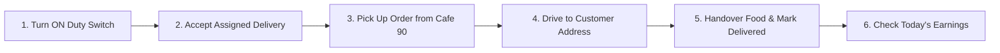

# Cafe 90 - Delivery Partner Guide & Easy Workflow

> **Welcome Cafe 90 Delivery Partners & Riders!**  
> This guide explains how to use the **Cafe 90 Delivery Partner App** to receive order assignments, pick up hot meals from the kitchen, navigate to customer addresses, complete deliveries smoothly, and track your daily earnings.

---

## 🛵 What is the Delivery Partner App?

The Delivery Partner App is designed to make your daily delivery work fast, clear, and hassle-free:
- Easy ON / OFF Duty switch to start work whenever you want.
- Clear delivery details showing customer name, phone number, and address.
- 1-Click buttons to update delivery progress (`Picked Up` -> `Out for Delivery` -> `Delivered`).
- Daily earnings summary showing completed deliveries and total money earned.

---

## 🛣️ Overview: The Delivery Driver Workflow

---

## 📖 Step-by-Step Guide for Delivery Drivers

### Step 1: Logging in & Going On-Duty

1. Open the Cafe 90 Delivery Partner Login page.
2. Enter your **Rider Phone Number / Email** and **Password**.
3. Click **"Login to Delivery Portal"**.
4. **Go On-Duty**:
   - At the top of your screen, toggle the **"Duty Status"** switch to **ON (Online - Green)**.
   - When you are **ON Duty**, the Cafe 90 admin can assign new orders to you.
   - If you are taking a break or ending your shift, toggle the switch to **OFF (Offline - Red)**.

---

### Step 2: Receiving & Accepting a Delivery Order

When the restaurant manager assigns a delivery order to you:

1. A new card will appear on your screen under **"Assigned Deliveries"**.
2. **Review Order Info**:
   - **Order ID**: (e.g., `#ORD-1042`)
   - **Customer Name**: (e.g., *"Ananya Sharma"*)
   - **Delivery Address**: (e.g., *"Flat 302, Sunrise Apartments, M.G. Road"*)
   - **Customer Phone Number**: Clickable phone button to call the customer if you need directions.
   - **Payment Mode**: Shows if it is **Paid Online** or **Cash on Delivery (COD)** (e.g., *Collect ₹450 Cash*).
3. Click **"Accept Delivery"**.

---

### Step 3: Pick Up Food from Cafe 90 Kitchen

1. Travel to the Cafe 90 restaurant kitchen counter.
2. Tell the chef/manager your **Order ID** (`#ORD-1042`).
3. Check the food package:
   - Ensure drinks, containers, and items match the order list.
4. Once the package is in your delivery bag, tap the green button on your app:  
   👉 **"Mark as Picked Up"**.
5. The customer will automatically see that their food is picked up and ready to arrive!

---

### Step 4: Driving to Customer Location & Delivery

1. Tap **"Start Navigation / Out for Delivery"**.
2. Drive safely to the customer's delivery address.
3. If you cannot find the house or gate code:
   - Tap the **"Call Customer"** button directly inside the app to speak to them.
4. Check special delivery instructions (e.g., *"Ring bell twice"* or *"Leave at security desk"*).

---

### Step 5: Handing Over Food & Marking Complete

1. Reach the customer's doorstep.
2. **If Cash on Delivery (COD)**:
   - Collect the exact cash amount shown on your screen (e.g., *Collect ₹450*).
3. Hand over the hot food package with a friendly smile!
4. Tap the final action button:  
   👉 **"Mark Order Delivered"**.
5. Great job! The order is now complete, and your earnings for this order are instantly added to your daily balance!

---

### Step 6: Tracking Your Daily Earnings & Trips

At the bottom of your Delivery Dashboard:
- View **"Completed Deliveries Today"** (e.g., `8 Orders`).
- View **"Total Earnings Today"** (e.g., `₹960`).
- View **"Cash Collected (COD)"** to know how much cash to hand back to the restaurant manager at shift end.

---

## 🛡️ Best Practices for Delivery Drivers

1. 🧼 **Keep Food Safe**: Ensure food containers are kept upright in your delivery bag so nothing spills.
2. 📱 **Keep App Updated**: Always tap **"Picked Up"** and **"Delivered"** on time so customers know when to open the door!
3. 🛵 **Safety First**: Follow all traffic signals and drive safely.
4. 📞 **Communication**: Call the customer polite and early if you face heavy traffic or road delays.
